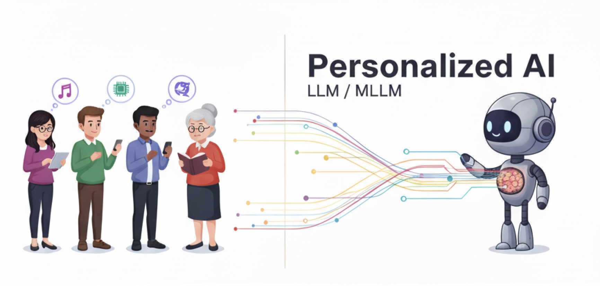

  

# Awesome Personalization in MLLMs

> 面向个性化 LLM 和 MLLM 的系统性调研与前沿进展整理，覆盖 <b>个性化记忆</b>、<b>对齐</b>、<b>检索</b>和<b>评估</b>。

[English README](./README.md) | [在线主页](https://clare-nie.github.io/Awesome-Personalization-in-MLLMs/)

## Overview

个性化 LLM / MLLM 的目标，不只是让模型对“平均用户”表现更好，而是让模型理解一个具体用户：长期目标、动态偏好、隐式 persona、多模态上下文，以及什么时候应该使用个性化信息、什么时候不应该使用。

本仓库主要整理四个方向的论文、系统、数据集和 benchmark：

| 方向 | 核心问题 |
| :--- | :--- |
| **个性化记忆** | agent 应该存什么、更新什么、检索什么、压缩什么、遗忘什么？ |
| **个性化对齐** | 模型如何适配个体偏好、人格和上下文？ |
| **个性化检索** | 系统如何选择正确的用户上下文、记忆和证据？ |
| **Benchmark 与评估** | 如何评测长期、动态、隐式、多模态的个性化能力？ |

## Table of Contents

- [Overview](#overview)
- [个性化记忆](#个性化记忆)
- [个性化对齐](#个性化对齐)
- [个性化检索](#个性化检索)
- [Benchmark 与评估](#benchmark-与评估)
- [贡献](#贡献)

## 个性化记忆

### 基于记忆架构

| 时间 | Paper Title | Venue | Publication | GitHub / Stars |
| :--- | :--- | :--- | :--- | :--- |
| 2026.05 | [Belief Memory: Agent Memory Under Partial Observability](https://arxiv.org/abs/2605.05583) | MBZUAI / RIKEN AIP / UT Austin / Wuhan University | arXiv | - |
| 2026.05 | [MemFlow: Intent-Driven Memory Orchestration for Small Language Model Agents](https://arxiv.org/abs/2605.03312) | New Jersey Institute of Technology | arXiv | - |
| 2026.01 | [EverMemOS: A Self-Organizing Memory Operating System for Structured Long-Horizon Reasoning](https://arxiv.org/abs/2601.02163) | EverMind AI | arXiv | [EverMind-AI/EverMemOS](https://github.com/EverMind-AI/EverMemOS)    |
| 2025.10 | [LightMem: Lightweight and Efficient Memory-Augmented Generation](https://arxiv.org/abs/2510.18866) | ZJUNLP | ICLR 2026 | [zjunlp/LightMem](https://github.com/zjunlp/LightMem)    |
| 2025.06 | [Memory OS of AI Agent](https://arxiv.org/abs/2506.06326) | MemoryOS Team | EMNLP 2025 | - |
| 2025.04 | [Mem0: Building Production-Ready AI Agents with Scalable Long-Term Memory](https://arxiv.org/abs/2504.19413) | Mem0 | arXiv | [mem0ai/mem0](https://github.com/mem0ai/mem0)    |
| 2025.02 | [A-Mem: Agentic Memory for LLM Agents](https://arxiv.org/abs/2502.12110) | Rutgers University | arXiv | [agiresearch/A-mem](https://github.com/agiresearch/A-mem)    |
| 2023.10 | [MemGPT: Towards LLMs as Operating Systems](https://arxiv.org/abs/2310.08560) | UC Berkeley | arXiv | [letta-ai/letta](https://github.com/letta-ai/letta)    |

### 个性化记忆架构

| 时间 | Paper Title | Venue | Publication | GitHub / Stars |
| :--- | :--- | :--- | :--- | :--- |
| 2026.05 | [ScrapMem: A Bio-inspired Framework for On-device Personalized Agent Memory via Optical Forgetting](https://arxiv.org/abs/2605.03804) | Nanjing Agricultural University | arXiv | - |
| 2026.04 | [Learning to Forget -- Hierarchical Episodic Memory for Lifelong Robot Deployment](https://arxiv.org/abs/2604.11306) | Karlsruhe Institute of Technology | arXiv | - |
| 2026.03 | [PersonaVLM: Long-Term Personalized Multimodal LLMs](https://github.com/MiG-NJU/PersonaVLM) | Nanjing University | CVPR 2026 | [MiG-NJU/PersonaVLM](https://github.com/MiG-NJU/PersonaVLM)    |
| 2025.12 | [MemVerse: Multimodal Memory for Lifelong Learning Agents](https://arxiv.org/abs/2512.03627) | Shanghai AI Laboratory | arXiv | [KnowledgeXLab/MemVerse](https://github.com/KnowledgeXLab/MemVerse)    |
| 2025.08 | [Seeing, Listening, Remembering, and Reasoning: A Multimodal Agent with Long-Term Memory](https://arxiv.org/abs/2508.09736) | ByteDance Seed | ICLR 2026 | [ByteDance-Seed/m3-agent](https://github.com/ByteDance-Seed/m3-agent)    |
| 2025.07 | [MIRIX: Multi-Agent Memory System for LLM-Based Agents](https://arxiv.org/abs/2507.07957) | MIRIX AI | arXiv | [Mirix-AI/MIRIX](https://github.com/Mirix-AI/MIRIX)    |

### Latent Memory 机制

| 时间 | Paper Title | Venue | Publication | GitHub / Stars |
| :--- | :--- | :--- | :--- | :--- |
| 2025.09 | [MemGen: Weaving Generative Latent Memory for Self-Evolving Agents](https://arxiv.org/abs/2509.24704) | National University of Singapore | ICLR 2026 | [KANABOON1/MemGen](https://github.com/KANABOON1/MemGen)    |
| 2025.03 | [AI-native Memory 2.0: Second Me](https://arxiv.org/abs/2503.08102) | Mindverse AI | arXiv | [Mindverse/Second-Me](https://github.com/Mindverse/Second-Me)    |
| 2025.02 | [M+: Extending MemoryLLM with Scalable Long-Term Memory](https://arxiv.org/abs/2502.00592) | UC San Diego / MIT-IBM Watson AI Lab / IBM Research / Amazon | ICML 2025 | [wangyu-ustc/MemoryLLM](https://github.com/wangyu-ustc/MemoryLLM)    |
| 2024.06 | [AI-native Memory: A Pathway from LLMs Towards AGI](https://arxiv.org/abs/2406.18312) | Mindverse AI | arXiv | - |
| 2024.02 | [MEMORYLLM: Towards Self-Updatable Large Language Models](https://arxiv.org/abs/2402.04624) | UC San Diego / Amazon / UCLA | ICML 2024 | [wangyu-ustc/MemoryLLM](https://github.com/wangyu-ustc/MemoryLLM)    |
| 2023.04 | [Scaling Transformer to 1M tokens and beyond with RMT](https://arxiv.org/abs/2304.11062) | MIPT / AIRI / London Institute for Mathematical Sciences | AAAI 2024 | [booydar/recurrent-memory-transformer](https://github.com/booydar/recurrent-memory-transformer)    |

## 个性化对齐

| 时间 | Paper Title | Venue | Publication | GitHub / Stars |
| :--- | :--- | :--- | :--- | :--- |
| 2026.06 | [TriAlign: Towards Universal Truth Consistency in Personalized LLM Alignment](https://arxiv.org/abs/2606.01755) | Monash University | arXiv | - |
| 2026.06 | [Beyond Isolated Behaviors: Hierarchical User Modeling for LLM Personalization](https://arxiv.org/abs/2606.02300) | Fudan University / Shanghai Innovation Institute / OPPO | arXiv | - |
| 2026.05 | [MATO: Multi-objective Personalized Alignment with Test-time Optimization for Large Language Models](https://arxiv.org/abs/2605.25342) | Monash University / Defence Science and Technology Group Australia | arXiv | - |
| 2026.04 | [Preference Heads in Large Language Models: A Mechanistic Framework for Interpretable Personalization](https://arxiv.org/abs/2604.22345) | McGill University / Mila / MBZUAI / Salesforce | arXiv | - |
| 2026.03 | [PersonaVLM: Long-Term Personalized Multimodal LLMs](https://github.com/MiG-NJU/PersonaVLM) | Nanjing University | CVPR 2026 | [MiG-NJU/PersonaVLM](https://github.com/MiG-NJU/PersonaVLM)    |
| 2025.10 | [POPI: Personalizing LLMs via Optimized Natural Language Preference Inference](https://arxiv.org/abs/2510.17881) | UIUC / Amazon / University of Notre Dame | arXiv | - |
| 2025.10 | Preference-Aware Memory Update for Long-Term LLM Agents | - | arXiv | - |
| 2025.09 | Personalized Reasoning / PrefDisco | - | ICLR 2026 | - |
| 2025.08 | Persistent Instability in LLM's Personality Measurements: Effects of Scale, Reasoning, and Conversation History | - | arXiv | - |
| 2025.05 | Teaching Language Models to Evolve with Users: Dynamic Profile Modeling for Personalized Alignment | - | arXiv | - |
| 2025.03 | ALIGNX: From 1,000,000 Users to Every User: Scaling Up Personalized Preference for User-level Alignment | - | arXiv | - |
| 2024.10 | Aligning LLMs with Individual Preferences via Interaction | - | arXiv | - |
| 2023.10 | [Personalized Soups: Personalized Large Language Model Alignment via Post-hoc Parameter Merging](https://arxiv.org/abs/2310.11564) | - | arXiv | - |

## 个性化检索

| 时间 | Paper Title | Venue | Publication | GitHub / Stars |
| :--- | :--- | :--- | :--- | :--- |
| 2026.05 | [MemReranker: Reasoning-Aware Reranking for Agent Memory Retrieval](https://arxiv.org/abs/2605.06132) | MemTensor / China Telecom / Shanghai Jiao Tong University | arXiv | [MemTensor/MemOS](https://github.com/MemTensor/MemOS)    |
| 2026.05 | [An Agent-Oriented Pluggable Experience-RAG Skill for Experience-Driven Retrieval Strategy Orchestration](https://arxiv.org/abs/2605.03989) | Macao Polytechnic University | arXiv | - |
| 2026.05 | [From Volume to Value: Preference-Aligned Memory Construction for On-Device RAG](https://arxiv.org/abs/2605.18271) | - | arXiv | - |
| 2025.01 | [Personalized Graph-Based Retrieval for Large Language Models (PGraphRAG)](https://arxiv.org/abs/2501.02157) | UC Santa Cruz / Meta AI / Adobe Research | arXiv | - |
| 2024.11 | [Pearl: Personalizing Large Language Model Writing Assistants with Generation-Calibrated Retrievers](https://aclanthology.org/2024.customnlp4u-1.16/) | Microsoft / Purdue | CustomNLP4U 2024 | - |
| 2024.09 | [Crafting Personalized Agents through Retrieval-Augmented Generation on Editable Memory Graphs (EMG-RAG)](https://arxiv.org/abs/2409.19401) | Huawei | arXiv | - |
| 2024.07 | [PersonaRAG: Enhancing Retrieval-Augmented Generation Systems with User-Centric Agents](https://arxiv.org/abs/2407.09394) | University of Passau | arXiv | - |
| 2024.07 | [MeMemo: On-device Retrieval Augmentation for Private and Personalized Text Generation](https://arxiv.org/abs/2407.01972) | Georgia Tech | SIGIR 2024 | [poloclub/mememo](https://github.com/poloclub/mememo)    |
| 2024.01 | [UniMS-RAG: A Unified Multi-source Retrieval-Augmented Generation for Personalized Dialogue Systems](https://arxiv.org/abs/2401.13256) | CUHK / University of Edinburgh | arXiv | - |
| 2023.12 | [Learning Retrieval Augmentation for Personalized Dialogue Generation (LAPDOG)](https://arxiv.org/abs/2406.18847) | University of Surrey / SUSTech / ByteDance | EMNLP 2023 | [hqsiswiliam/LAPDOG](https://github.com/hqsiswiliam/LAPDOG)    |
| 2023.07 | [Personalized Retrieval over Millions of Items (XPERT)](https://www.microsoft.com/en-us/research/publication/personalized-retrieval-over-millions-of-items/) | Microsoft Research | SIGIR 2023 | [personalizedretrieval/xpert](https://github.com/personalizedretrieval/xpert)    |
| 2023.07 | [PersonalTM: Transformer Memory for Personalized Retrieval](https://www.amazon.science/publications/personaltm-transformer-memory-for-personalized-retrieval) | Amazon | SIGIR 2023 | - |
| 2023.04 | [A Personalized Dense Retrieval Framework for Unified Information Access](https://arxiv.org/abs/2304.13654) | UMass Amherst / Lowe's | SIGIR 2023 | - |

## Benchmark 与评估

| 时间 | Paper Title | Venue | Publication | GitHub / Stars |
| :--- | :--- | :--- | :--- | :--- |
| 2026.05 | [Preference-Aware Rubric Learning for Personalized Evaluation (PARL)](https://arxiv.org/abs/2605.31545) | National University of Singapore / Xiaohongshu / University of Tokyo | arXiv | [SnowCharmQ/PARL](https://github.com/SnowCharmQ/PARL)    |
| 2026.05 | [Personalize-then-Store: Benchmarking and Learning Personalized Memory for Long-horizon Agents (PerMemBench)](https://arxiv.org/abs/2605.25535) | KAIST | arXiv | [yeonjun-in/PerMemBench](https://github.com/yeonjun-in/PerMemBench)    |
| 2026.05 | [MemEye: A Visual-Centric Evaluation Framework for Multimodal Agent Memory](https://arxiv.org/abs/2605.25007) | Swinburne University of Technology / Southeast University / Tongji University | arXiv | - |
| 2026.04 | [From Recall to Forgetting: Benchmarking Long-Term Memory for Personalized Agents](https://arxiv.org/abs/2604.20006) | Arizona State University | arXiv | - |
| 2026.04 | [Personalized Benchmarking: Evaluating LLMs by Individual Preferences](https://arxiv.org/abs/2604.18943) | University of Chicago | Findings of ACL 2026 | - |
| 2026.04 | [CoPA: Benchmarking Personalized Question Answering with Data-Informed Cognitive Factors](https://arxiv.org/abs/2604.14773) | East China Normal University | arXiv | [bjzgcai/CoPA](https://github.com/bjzgcai/CoPA)    |
| 2026.03 | [Persona-MME from PersonaVLM: Long-Term Personalized Multimodal LLMs](https://github.com/MiG-NJU/PersonaVLM) | Nanjing University | CVPR 2026 | [MiG-NJU/PersonaVLM](https://github.com/MiG-NJU/PersonaVLM)    |
| 2025.12 | [PERSONAMEM-V2: Towards Personalized Intelligence via Learning Implicit User Personas and Agentic Memory](https://arxiv.org/abs/2512.06688) | University of Pennsylvania | arXiv | [bowen-upenn/PersonaMem-v2](https://github.com/bowen-upenn/PersonaMem-v2)    |
| 2025.06 | [PersonaFeedback: A Large-scale Human-annotated Benchmark For Personalization](https://arxiv.org/abs/2506.12915) | UESTC / OPPO | arXiv | - |
| 2025.04 | [Know Me, Respond to Me: Benchmarking LLMs for Dynamic User Profiling and Personalized Responses at Scale (PERSONAMEM)](https://arxiv.org/abs/2504.14225) | University of Pennsylvania | COLM 2025 | [bowen-upenn/PersonaMem](https://github.com/bowen-upenn/PersonaMem)    |
| 2024.10 | [LONGMEMEVAL: Benchmarking Chat Assistants on Long-Term Interactive Memory](https://arxiv.org/abs/2410.10813) | UCLA / Tencent AI Lab | ICLR 2025 | [xiaowu0162/LongMemEval](https://github.com/xiaowu0162/LongMemEval)    |
| 2024.02 | [Evaluating Very Long-Term Conversational Memory of LLM Agents (LoCoMo)](https://arxiv.org/abs/2402.17753) | UNC Chapel Hill / Snap Inc. | ACL 2024 | [snap-research/locomo](https://github.com/snap-research/locomo)    |
| 2023.04 | [LaMP: When Large Language Models Meet Personalization](https://arxiv.org/abs/2304.11406) | UMass Amherst / Google Research | ACL 2024 | [LaMP-Benchmark/LaMP](https://github.com/LaMP-Benchmark/LaMP)    |

## Notes

GitHub star 数量通过 shields.io 动态徽章显示。

## 贡献

欢迎补充论文、代码、benchmark、数据集和简短说明。请参考 [CONTRIBUTING.md](./CONTRIBUTING.md)。

## 引用

如果这个列表对你有帮助，欢迎在仓库发布后 star 或引用。

## License

本仓库采用 MIT License。
